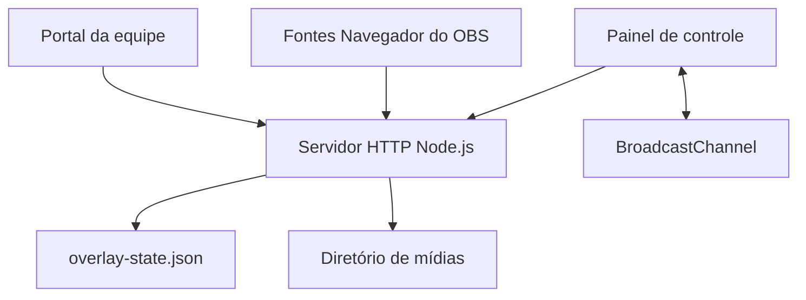

# Especificação técnica — Juventude Overlay Studio

## 1. Visão geral

O Juventude Overlay Studio é uma aplicação web monolítica e sem dependências externas de runtime. Um servidor Node.js entrega a interface estática e expõe APIs HTTP para sincronizar o estado das transmissões, guardar equipes e armazenar mídias.

O mesmo código de interface atende quatro contextos:

- painel principal de operação;
- módulos administrativos separados;
- fontes transparentes para o OBS;
- portal de cadastro de cada equipe.

## 2. Tecnologias

| Camada | Tecnologia |
|---|---|
| Interface | HTML5, CSS moderno e JavaScript ES2022 |
| Servidor local | Node.js 20+ usando `node:http` |
| Contêiner | Node.js 22 Alpine |
| Persistência local | JSON em disco e diretório de arquivos |
| Persistência no Sites | Cloudflare D1 e R2 |
| Comunicação entre abas | BroadcastChannel, localStorage e sincronização HTTP |
| Build hospedado | Worker ESM compatível com Cloudflare |
| Testes | Node.js, `assert`, VM e servidor HTTP real |

Não há React, banco SQL local, bundler ou pacote npm obrigatório em produção.

## 3. Requisitos de infraestrutura

### Mínimos para uso local

- CPU: 1 núcleo x86-64 ou ARM64;
- memória: 128 MB para o contêiner; recomenda-se 256 MB;
- armazenamento: 100 MB mais as mídias enviadas;
- rede: TCP na porta 4173 ou outra configurada;
- navegador: Chrome, Edge ou Chromium atualizado;
- OBS Studio com fonte Navegador baseada em Chromium.

### Recomendados para transmissão

- computador conectado por cabo ao roteador;
- armazenamento persistente em SSD;
- 512 MB de memória disponível para o serviço;
- proxy HTTPS se houver acesso externo;
- backup periódico do volume.

## 4. Arquitetura



No Docker, estado e mídias ficam no volume `/app/.data`. Na versão hospedada pelo Sites, a persistência equivalente usa D1 para dados estruturados e R2 para arquivos.

## 5. Rotas de interface

| Rota | Finalidade |
|---|---|
| `/` | Painel principal da partida |
| `/manage` | Central de módulos |
| `/manage/scoreboard` | Placar e relógio |
| `/manage/events` | Gols, cartões, substituições e GC |
| `/manage/lineup` | Escalações e apresentação |
| `/manage/sponsors` | Patrocinadores e barra 1500×200 |
| `/manage/pregame` | Resumo para narradores |
| `/manage/report` | Relatório e histórico da partida |
| `/manage/teams` | Cadastro geral de equipes |
| `/manage/appearance` | Aparência e tema do campeonato |
| `/preview` | Visualização completa em 1920×1080 |
| `/overlay` | Saída transparente para o OBS |
| `/team?token=...` | Portal restrito de uma equipe |
| `/health` | Verificação de disponibilidade |

## 6. Parâmetros das fontes do OBS

| Parâmetro | Valores | Descrição |
|---|---|---|
| `room` | texto seguro, até 48 caracteres | Isola uma partida/sala |
| `layer` | `all`, `scoreboard`, `event`, `lineup`, `photo-lineup`, `sponsor` | Seleciona o overlay |

Todas as telas que participam da mesma transmissão devem usar o mesmo valor de `room`.

## 7. APIs locais

| Método e rota | Uso |
|---|---|
| `GET /health` | Estado do serviço |
| `GET /api/state?room=...` | Obtém o estado de uma sala |
| `PUT /api/state?room=...` | Atualiza o estado de uma sala |
| `GET /api/teams` | Obtém catálogo de equipes e temas |
| `PUT /api/teams` | Atualiza catálogo de equipes e temas |
| `GET /api/team-portal?token=...` | Obtém os dados da equipe autorizada |
| `PUT /api/team-portal?token=...` | Atualiza somente a equipe autorizada |
| `GET/PUT /api/team-athlete-photo` | Lê ou envia foto de atleta/comissão |
| `GET/PUT /api/assets/...` | Lê ou envia escudos e mídias de overlays |

As respostas de estado usam `cache-control: no-store`. Atualizações concorrentes são comparadas pelo campo numérico `updatedAt`.

## 8. Modelo de dados principal

O estado de uma sala inclui:

- modalidade, competição e local;
- equipes, placar e escalações selecionadas;
- cronômetro, período e acréscimos;
- parciais e horários reais da partida;
- visibilidade e transições de cada overlay;
- eventos com minuto, período, equipe e placar;
- patrocinadores, mídias e looping;
- aparência e tema do campeonato;
- relatórios concluídos da partida.

O catálogo global inclui equipes reutilizáveis, atletas, comissão, esquema tático, tokens de acesso e temas salvos por competição.

## 9. Sincronização e isolamento

O painel salva primeiro no navegador e comunica outras abas pelo `BroadcastChannel`. Em seguida, envia o estado ao servidor. As fontes do OBS consultam periodicamente o servidor para receber atualizações de outras máquinas ou sessões.

Na saída `layer=all`, cada overlay é mantido em um slot independente. Uma impressão digital específica por componente determina o que realmente mudou. Assim, a rotação de patrocinadores não desmonta o placar, não reinicia suas animações e não interfere em outros overlays.

## 10. Persistência local

Variáveis suportadas:

| Variável | Padrão | Finalidade |
|---|---|---|
| `HOST` | `0.0.0.0` | Interface de rede |
| `PORT` | `4173` | Porta interna |
| `OVERLAY_STATE_FILE` | `.data/overlay-state.json` | Arquivo principal de dados |
| `OVERLAY_PORT` | `4173` | Porta externa do Docker Compose |

Arquivos enviados ficam em um diretório `assets` ao lado do arquivo de estado. O Docker monta todo o diretório `.data` como volume persistente.

## 11. Limites de upload

| Tipo | Limite |
|---|---:|
| Escudo | 2 MB na interface |
| Foto de atleta/comissão | 5 MB |
| Logo/banner comum | 5 MB |
| Imagem da barra 1500×200 | 8 MB |
| Mídia da escalação | 25 MB |
| Vídeo único da barra 1500×200 | 50 MB |

## 12. Segurança

- nomes de sala, arquivos e IDs são normalizados antes de uso em caminhos;
- caminhos estáticos são resolvidos e validados contra saída do diretório público;
- o portal da equipe exige o token associado ao time;
- tamanhos e formatos são limitados na interface e no servidor;
- o contêiner executa como usuário sem privilégios.

Para internet pública, recomenda-se adicionar autenticação no proxy reverso. O painel geral não possui conta e senha próprias na edição autônoma. Tokens de equipe devem ser tratados como links privados e regenerados caso sejam compartilhados indevidamente.

## 13. Compatibilidade

- resolução de projeto dos overlays: 1920×1080;
- animações desenhadas para 60 fps;
- imagens: PNG, JPEG, WebP e SVG onde indicado;
- vídeos: MP4 e WebM;
- navegadores-alvo: Chromium atual;
- arquiteturas Docker: amd64 e arm64, conforme suporte da imagem Node Alpine.

## 14. Observabilidade

O endpoint `/health` responde HTTP 200 quando o servidor está ativo. O Docker consulta esse endpoint a cada 30 segundos. Falhas de leitura, gravação ou sincronização são registradas na saída padrão do contêiner.

Comandos úteis:

```bash
docker compose ps
docker compose logs -f overlay-studio
docker inspect --format='{{json .State.Health}}' juventude-overlay-studio
```

## 15. Testes e build

```bash
npm test
npm run build
```

Os testes cobrem rotas, persistência, controles, sincronização, isolamento das saídas, modalidades, uploads e animações. O build cria `dist/server/index.js` e os recursos estáticos em `dist/client/` para publicação compatível com Cloudflare.

## 16. Estratégia de implantação

### Docker/VPS

1. construir a imagem;
2. montar volume em `/app/.data`;
3. publicar a porta 4173;
4. configurar proxy reverso e HTTPS;
5. manter backup do volume.

### Cloudflare/Sites

O `build.mjs` produz um Worker ESM autocontido. O manifesto `.openai/hosting.json` declara os bindings lógicos `DB` e `BUCKET` usados pela hospedagem gerenciada.

## 17. Pontos de customização

- `public/styles.css`: identidade visual, tamanhos e animações;
- `public/app.js`: regras dos overlays, interface e estado;
- `server.mjs`: APIs e persistência autônoma;
- `docker-compose.yml`: porta, reinício e volume;
- `.env`: configuração local sem alterar o código.
